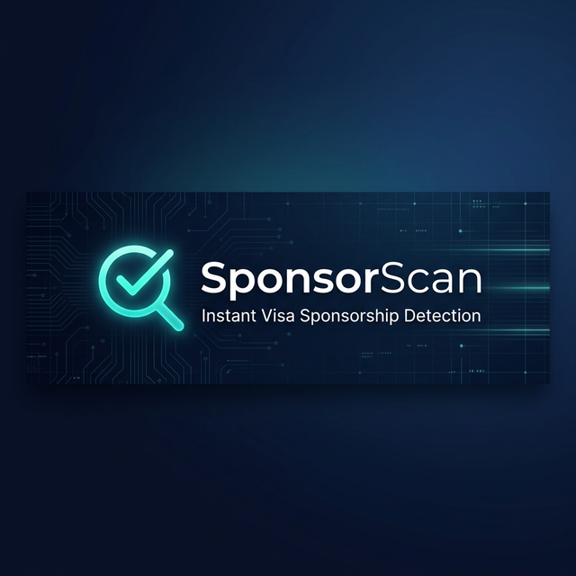

<p align="center">
  
</p>

<p align="center">
  <strong>Instantly detect visa sponsorship signals in any job posting.</strong><br>
  Works on LinkedIn, Indeed, Glassdoor, and every job board worldwide.
</p>

<p align="center">
  
  
  
  
  
</p>

---

## 🔍 What is SponsorScan?

**SponsorScan** is a Chrome extension that scans any job posting and instantly tells you whether the employer mentions visa sponsorship — **positive**, **negative**, or **ambiguous**.

Stop wasting time reading through entire job descriptions. Open the popup, click scan, and get a clear result in under a second.

### The Problem

Millions of international job seekers spend hours reading through job postings trying to figure out if a company will sponsor their visa. The language is often buried, inconsistent, or deliberately vague.

### The Solution

SponsorScan uses a **290+ phrase detection engine** with smart negation analysis and false positive protection to scan every word on the page and give you a clear, color-coded answer.

---

## ✨ Features

### Core Detection Engine
- **290+ signal phrases** covering positive, negative, and ambiguous sponsorship language
- **Smart negation detection** — catches phrases like *"we do **not** offer visa sponsorship"* even when the word "not" is 6+ words away from "sponsorship"
- **False positive protection** — 50+ exclusion phrases prevent false matches (e.g., "security check" ≠ "security clearance required", "event sponsor" ≠ "visa sponsor")
- **Country detection** — automatically identifies the job's country from city names, currencies, and URL patterns across 20+ countries

### Multi-Language Support (9 Languages)
| Language | Positive Example | Negative Example |
|----------|-----------------|-----------------|
| 🇺🇸 English | "visa sponsorship available" | "no visa sponsorship" |
| 🇩🇪 German | "Visumsponsoring" | "kein Visumsponsoring" |
| 🇫🇷 French | "parrainage de visa" | "pas de parrainage de visa" |
| 🇳🇱 Dutch | "relocatiepakket" | "geen visumsponsoring" |
| 🇪🇸 Spanish | "patrocinio de visa disponible" | "no se ofrece patrocinio de visa" |
| 🇧🇷 Portuguese | "patrocínio de visto disponível" | "não oferecemos patrocínio de visto" |
| 🇯🇵 Japanese | "ビザサポートあり" | "就労ビザのサポートは行っておりません" |
| 🇰🇷 Korean | "비자 스폰서십 가능" | "비자 스폰서십 불가" |
| 🇸🇦 Arabic | "كفالة عمل متوفرة" | "للمواطنين فقط" |

### Regional Coverage
| Region | Positive Signals | Negative Signals |
|--------|-----------------|-----------------|
| 🇺🇸 United States | H-1B, EB-2/3, green card, OPT/CPT, PERM | "must be authorized without sponsorship" |
| 🇬🇧 United Kingdom | Skilled Worker Visa, CoS, sponsor licence | "we are not a licensed sponsor" |
| 🇦🇺 Australia | 482/494/457 sponsorship, DAMA | "must have Australian work rights" |
| 🇨🇦 Canada | LMIA, PGWP, Global Talent Stream | "Canadian citizens and PRs only" |
| 🇦🇪 Gulf States | iqama, golden visa, free zone visa | "GCC nationals only" |
| 🇪🇺 European Union | EU Blue Card, talent passport | "EU citizens only" |
| 🌏 Asia-Pacific | Employment pass, dependent pass | country-specific restrictions |

### UI & UX
- 🌗 **Dark / Light theme** toggle with preference saved
- 📋 **Copy results** to clipboard with one click
- 🔄 **Rescan** button for quick re-analysis
- 🎯 **Highlight signals** directly on the job page with scroll-to-first
- 🕸️ **SPA support** — aggressive text extraction with Shadow DOM traversal
- ⚡ **Instant results** — scans in under 100ms

---

## 📥 Installation

### From Source (Developer)

1. **Clone this repository**
   ```bash
   git clone https://github.com/saibighnesh/SponsorScan.git
   ```

2. **Open Chrome Extensions**
   ```
   Navigate to chrome://extensions/
   ```

3. **Enable Developer Mode**
   Toggle the switch in the top-right corner.

4. **Load the extension**
   Click **"Load unpacked"** and select the cloned folder.

5. **Pin the extension**
   Click the puzzle piece icon in Chrome's toolbar and pin SponsorScan.

### From Chrome Web Store
> Coming soon — stay tuned!

---

## 🚀 Usage

1. Navigate to **any job posting** on any website
2. Click the **SponsorScan** icon in your toolbar
3. View your results instantly:

| Status | Meaning |
|--------|---------|
| 🟢 **Positive** | The posting mentions visa sponsorship |
| 🔴 **Negative** | The posting explicitly says no sponsorship |
| 🟡 **Mixed** | Both positive and negative signals found |
| ⚪ **No Info** | No sponsorship language detected |

---

## 🏗️ Architecture

```
sponsorscan/
├── manifest.json        # Chrome Extension manifest (MV3)
├── detector.js          # Core detection engine (290+ signals)
├── popup.html           # Extension popup UI
├── popup.js             # Popup logic, theme, copy, rescan
├── styles.css           # Dark/light theme CSS variables
├── test.js              # Automated test suite
├── icons/
│   ├── icon16.png
│   ├── icon48.png
│   └── icon128.png
└── store_assets/
    ├── banner.png
    ├── promo_440x280.png
    ├── promo_1280x800.png
    ├── description.txt
    └── privacy-policy.md
```

### How Detection Works

```
Page Text → Normalize → Mask Negatives → Mask False Positives
                                              ↓
                              Detect Positives (with CJK support)
                                              ↓
                              Check Implicit Negation (6-word window)
                                              ↓
                              Detect Ambiguous Signals
                                              ↓
                              Detect Country (cities, currencies, URLs)
                                              ↓
                              Generate Status + Summary
```

1. **Normalize** — Collapse whitespace and lowercase
2. **Mask negatives** — Remove explicit negative phrases so they don't trigger positive matches
3. **Mask false positives** — Remove non-immigration phrases (e.g., "event sponsor", "security check")
4. **Detect positives** — Match remaining text against 140+ positive signals
5. **Implicit negation** — Check if matched positive signals have "no", "not", "without" up to 6 words before them
6. **Ambiguous signals** — Detect phrases like "relocation" or "right to work" that could go either way
7. **Country detection** — Identify the job's country from city names, currency symbols, and URL patterns

---

## 🧪 Testing

Run the test suite:

```bash
node test.js
```

The test suite covers:
- ✅ Explicit positive and negative signals
- ✅ Implicit negation detection
- ✅ Mixed signal handling
- ✅ Multi-language detection (German, French, Japanese, Korean, etc.)
- ✅ Country detection from cities, currencies, and URLs
- ✅ False positive protection (security checks, EEO language, event sponsors, etc.)
- ✅ SPA and Shadow DOM text extraction

---

## 🤝 Contributing

Contributions are welcome! Here's how you can help:

### Adding New Signals

1. Fork the repo
2. Add your phrases to `detector.js`:
   - `positiveSignals` — phrases that indicate sponsorship IS available
   - `negativeSignals` — phrases that indicate sponsorship is NOT available
   - `ambiguousSignals` — phrases that could mean either
   - `falsePositiveContexts` — phrases that look like signals but aren't about immigration
3. Run `node test.js` to make sure nothing breaks
4. Submit a pull request with examples of real job postings where you found these phrases

### Reporting Issues

Found a job posting where SponsorScan gave a wrong result? Open an issue with:
- The URL of the job posting (or the text if behind a login)
- What SponsorScan detected
- What the correct result should be

---

## 🔒 Privacy

SponsorScan is **100% client-side**. It:
- ❌ Does NOT send any data to external servers
- ❌ Does NOT track your browsing history
- ❌ Does NOT require any account or signup
- ❌ Does NOT use analytics or telemetry
- ✅ Only reads the text of the page you're currently viewing
- ✅ Only stores your theme preference locally

---

## 📄 License

This project is licensed under the MIT License — see the [LICENSE](LICENSE) file for details.

---

## ⭐ Star This Repo

If SponsorScan helped you in your job search, please give it a ⭐ on GitHub — it means a lot and helps others find it!

---

<p align="center">
  Made with ❤️ for international job seekers everywhere
</p>
